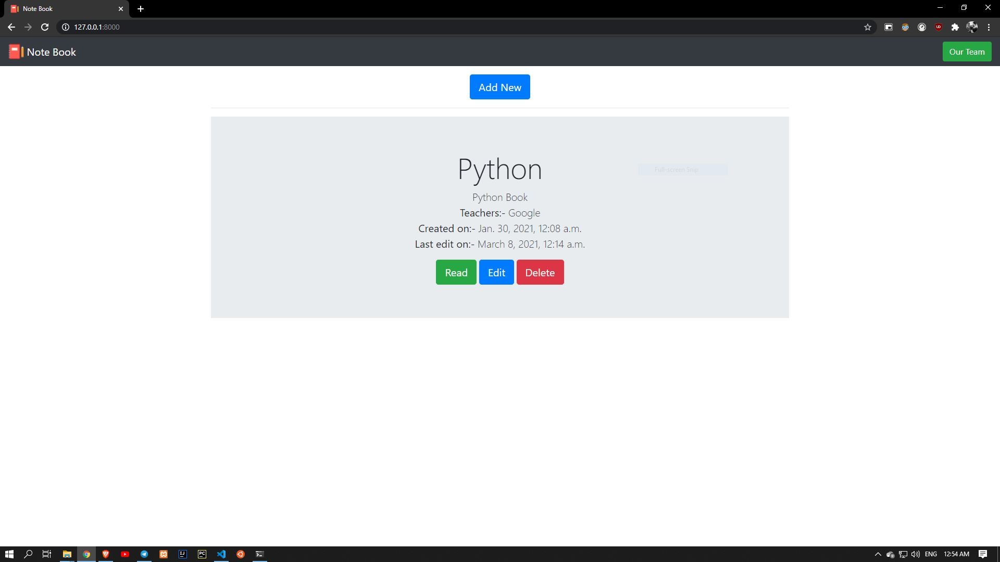

# E_NoteBook
## (A Django Project)

# Special Thanks to:-
## [Rahul Choudhury😎](https://github.com/ResonantMatrix)
## [Bootstrap](https://getbootstrap.com/)
## [Tiny](https://www.tiny.cloud/)

 

# Setup

## Install Django:
### Linux
#### (Install pip)
    sudo apt install python3-pip
#### (Install django)
    pip3 install django
### Windows
    pip install django

## Migrate:
### Linux
    python3 manage.py migrate
### Windows
    python manage.py migrate

## Run Development Server
### Linux
    python3 manage.py runserver
### Windows
    python manage.py runserver
## Public endpoint is at http://127.0.0.1:8000/
